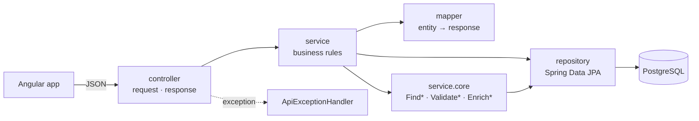
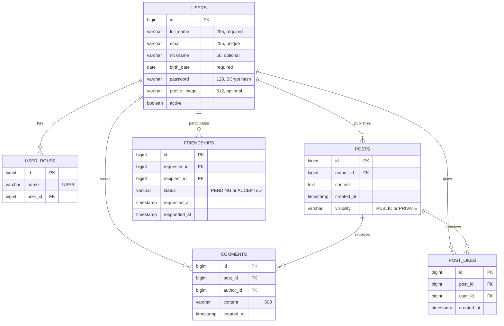

# DevConnect

[](https://github.com/marilioalmeida/devconnect/actions/workflows/ci.yml)

A social network for developers: a place to share what you're learning, follow the progress of the people you know and talk about code without the noise of general-purpose networks.

I'm learning Java and Spring Boot, and I built DevConnect to put what I'm studying into practice in a complete project: a REST API, a relational database with versioned migrations, token-based authentication, unit and integration tests, and a real frontend consuming it all.

The repository is a monorepo with two applications:

| Folder | Application | How to run |
| --- | --- | --- |
| [`api/`](api) | REST API with Spring Boot | [api/README.md](api/README.md) |
| [`app/`](app) | Angular SPA | [app/README.md](app/README.md) |

## Tech stack

**API**

- Java 21 and Spring Boot 3.3
- Spring Security + OAuth2 Resource Server (JWT signed with an RSA key pair)
- Spring Data JPA and PostgreSQL 16
- Flyway for database versioning
- springdoc-openapi (Swagger UI)
- JUnit 5, Mockito and Testcontainers

**App**

- Angular 22 with standalone components, signals and zoneless change detection
- Angular Material with a custom theme and dark mode
- `httpResource()` for reads and `@angular/forms/signals` for forms
- highlight.js for code blocks in posts
- Vitest

## Getting started

Requirements: Docker, JDK 21 and Node.js with npm.

```bash
# 1. Database
docker compose -f api/data/docker-compose.yml up -d

# 2. API (http://localhost:8080)
cd api && ./mvnw spring-boot:run

# 3. App (http://localhost:4200)
cd app && npm install && npm start
```

Flyway applies the migrations automatically when the API starts.

To explore a populated scenario instead of an empty database, load the demo data after the API has started once:

```bash
docker compose -f api/data/docker-compose.yml exec -T postgres psql -U devconnect -d devconnect < api/data/seed.sql
```

It creates 17 users, 18 public and private posts, likes, comments and friendships in different states. Log in as **`marilio@devconnect.com`** (password `password123`, the same for every account) to see the full scenario: a feed and a friends list with more than one page, two friend requests waiting to be accepted and one sent request waiting for an answer.

The script deletes existing data before inserting and can be run as many times as you like.

Interactive API documentation is available at `http://localhost:8080/swagger-ui.html`.

## Features

| Feature | API | Screen | Business rule |
| --- | --- | --- | --- |
| Sign up | `POST /users` | `/signup` | Unique email, case-insensitive (`ValidateUniqueEmailService` + unique index on `LOWER(email)`), password stored with BCrypt |
| Log in | `POST /login` | `/login` | JWT valid for 1 hour; inactive users cannot log in |
| Feed | `GET /posts/feed` | `/home` | Paginated feed with your posts and your friends' posts, newest first |
| Posts | `POST /posts`, `PATCH /posts/{id}`, `DELETE /posts/{id}` | `/home`, post card | Only the author can edit or delete a post |
| Visibility | `PATCH /posts/{id}/visibility` | post card | `PUBLIC` or `PRIVATE`, changeable at any time by the author |
| Likes | `POST\|DELETE\|GET /posts/{id}/likes` | post card | One like per user per post, even under concurrent requests |
| Comments | `POST\|GET /posts/{id}/comments`, `DELETE /posts/{id}/comments/{commentId}` | post card | The comment author or the post author can delete a comment |
| Code in posts | — | post card | ```` ```lang ```` fences and `` `inline code` `` rendered with syntax highlighting |
| Friend requests | `POST /friendships`, `GET /friendships/requests`, `PATCH /friendships/{id}/accept` | `/home` | A friendship only exists after the recipient accepts it |
| Discover people | `GET /users?search=` | `/discover` | A single field matches name **or** email; you cannot send a request to yourself or to an existing friend |
| Friends | `GET /friendships?search=`, `DELETE /friendships/{id}` | `/friends` | Same single search field; clicking a name opens the profile |
| Profiles | `GET /users/{id}`, `GET /users/{id}/posts` | `/profile/:id` | Private posts are only visible to friends; the action button switches between add, cancel, accept and remove |
| Edit profile | `PUT /users/me` | `/edit-profile` | Name, nickname and profile image |

Three details that back these rules:

- **Single name-or-email search**: one query with `LOWER(...) LIKE` over both columns, in [`UserRepository`](api/src/main/java/com/devconnect/api/user/repository/UserRepository.java) and [`FriendshipRepository`](api/src/main/java/com/devconnect/api/friendship/repository/FriendshipRepository.java). Whoever searches doesn't need to say what they are searching for.
- **Visibility**: [`ResolveAllowedVisibilitiesService`](api/src/main/java/com/devconnect/api/post/service/core/ResolveAllowedVisibilitiesService.java) decides, before the query runs, which visibilities a viewer may see on a given profile, and [`ValidatePostAccessService`](api/src/main/java/com/devconnect/api/post/service/core/ValidatePostAccessService.java) blocks likes and comments on private posts of people who aren't friends. The restriction lives in the `WHERE` clause, not in a filter applied after the query.
- **Friendship**: [`ValidateNewFriendshipService`](api/src/main/java/com/devconnect/api/friendship/service/core/ValidateNewFriendshipService.java) rejects requests to yourself and duplicate relationships, and [`ValidateFriendshipParticipantService`](api/src/main/java/com/devconnect/api/friendship/service/core/ValidateFriendshipParticipantService.java) makes sure only the recipient accepts and only a participant removes.

## Architecture

The API follows a layered structure: the controller speaks in `request`/`response` objects, the service holds the business rules, and an entity never crosses the controller boundary, not on its own and not nested inside a response.



Each feature (`user`, `post`, `comment`, `like`, `friendship`) is a self-contained package with the same internal structure, and each use case gets its own service (`CreatePostService`, `ListFeedService`, `AcceptFriendshipService`...).

The `service/core/` subpackage holds the operations that several services need: finding an entity and throwing 404 when it doesn't exist (`FindPostByIdService`), validating a precondition with the right status code (`ValidatePostAuthorshipService`), or preparing supporting data (`EnrichPostsService`). That keeps each use-case service readable: it orchestrates instead of piling up logic.

Two decisions worth highlighting:

- [`EnrichPostsService`](api/src/main/java/com/devconnect/api/post/service/core/EnrichPostsService.java) solves the feed's N+1 problem. Instead of loading likes and comments post by post, it runs three aggregate queries per page (like count, comment count and which posts the current user already liked) and combines them in memory.
- [`NowService`](api/src/main/java/com/devconnect/api/core/service/NowService.java) wraps `LocalDateTime.now()` in an injectable bean, which makes time deterministic in tests.

## Data model



The migrations live in [`api/src/main/resources/db/migration`](api/src/main/resources/db/migration) and go from `V1` to `V5`. They are the only source of the schema: Hibernate runs with `ddl-auto: validate` and never creates or changes tables.

The rules aren't enforced only in the service layer; the database guarantees them too:

- `uk_post_likes_post_user (post_id, user_id)` prevents liking the same post twice, including under concurrency. The service catches the violation and answers with 409.
- `ck_friendships_distinct_users` rejects a friend request to yourself.
- `uk_friendships_pair` is a unique index on `LEAST(requester_id, recipient_id), GREATEST(requester_id, recipient_id)`. Without it, `A → B` and `B → A` would be two different rows and the pair would end up with two friendships. With it, a friendship is unique no matter who sent the request.
- `uk_users_email_lower` is a unique index on `LOWER(email)`, so `Ana@Mail.com` and `ana@mail.com` cannot both sign up.

## Tests

```bash
cd api && ./mvnw test    # 214 tests: services, mappers, validators and integration
cd app && npm test       # 40 tests with Vitest
```

The API unit tests cover services, mappers and validators with Mockito. The integration tests start a real PostgreSQL with Testcontainers and exercise the API over HTTP. [`SocialJourneyIntegrationTest`](api/src/test/java/com/devconnect/api/integration/SocialJourneyIntegrationTest.java) walks through the whole journey in order: Ana and Bruno sign up and publish, Ana's private post doesn't show up for Bruno, Bruno likes the public post and is blocked on the private one, sends a friend request, Ana accepts it, and only then does the private post appear in his feed and on her profile.

Details on running the tests (including how to run only the unit suite, without Docker) are in [api/README.md](api/README.md).

## About the JWT signing keys

The API generates a new RSA key pair in memory every time it starts, so there is no private key in the repository and nothing to configure before running it locally. The trade-off is that tokens stop being valid after the API restarts; the app handles the resulting 401 by sending you back to the login screen.

In a real deployment the key pair would come from a secret store, mounted into the container or injected through the environment, and would be rotated periodically. Along the same lines, `application.yml` contains fixed local database credentials and SQL logging, which only make sense for local development.
